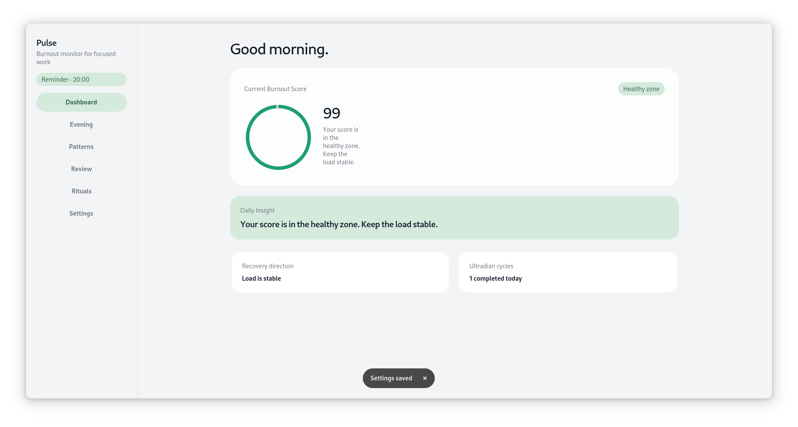
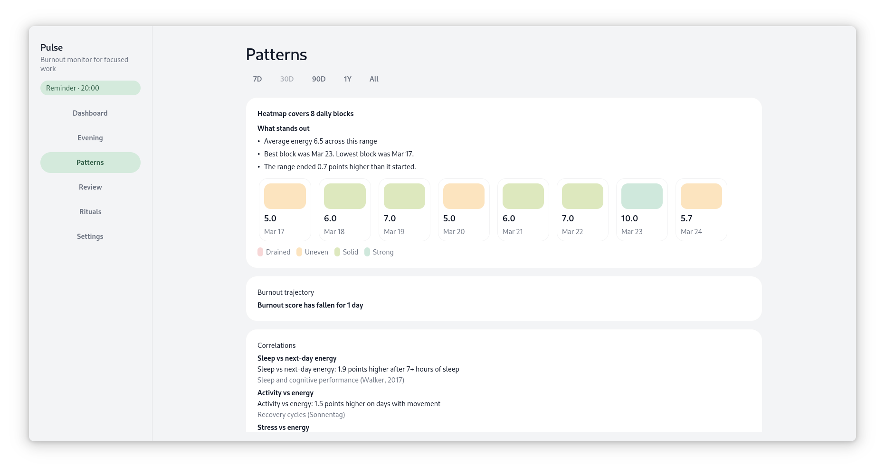

# Pulse

Pulse is a calm, local-first burnout and energy tracker for GNOME.

It helps you notice how your energy changes through the week, catch recovery problems earlier, and keep a few simple rituals in view without turning your day into another productivity system.

## What Pulse Does

- Log a quick evening check-in
- See your energy patterns over time
- Review weekly burnout signals
- Keep small rituals and reminders visible
- Store your data locally on your own device

## Screenshots





## Running Pulse

Run the app from the repository:

```bash
python3 -m pulse.main
```

If you want sample data for a quick preview:

```bash
python3 -m pulse.main --seed-demo
```

Run it as a local Flatpak build:

```bash
flatpak-builder --user --install --force-clean --disable-rofiles-fuse --repo=repo builddir io.github.srpvpn.pulse.json
flatpak run io.github.srpvpn.pulse
```

## Tests

```bash
python3 -m pytest tests -v
```

## Project Notes

- Built for GNOME with GTK 4 and Libadwaita
- Supports light and dark appearance
- Uses the application ID `io.github.srpvpn.pulse`
